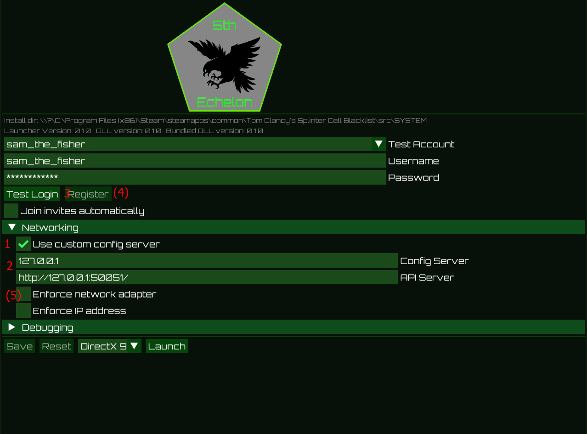

<p align="center">
    
</p>

# Dedicated server for EoL echelon games

This project is a community effort to keep the multiplayer of some
of the games with the great Sam Fisher alive.

For now it is focused on SC:BL, but the net code should be relatively
similar for previous games as well.


## Usage

### On the server host (can be the same as a player, but there should be only one running)

1. Start the server `dedicated_server.exe`
2. Note the (public) IP address of the server (like your VPN IP if you're using radmin/hamachi)
3. Open `service.toml` file and change all Values, secure_server_addr, storage_host, from 127.0.0.1 to your address from step 2
3. Make sure the ports tcp/80, tcp/50051, tcp/8000, udp/21120 and udp/21127 are open to your peers (allowed in firewall or firewall off)

### On the clients (all players who want to connect to the community server)

1. Make sure that the port UDP 13000 is open in your firewall (and router if you are not using a VPN)
2. Start the launcher
3. Under networking
    1. Enable `Use custom config server`
    2. Enter the addresses of the server (like `127.0.0.1` for `Config Server` and `http://127.0.0.1:50051/` for `API Server`). Change the IP accordingly
    3. Test if it is configured correctly by using `Test Login` with a test account
    4. Optional: Register a new account (clear the username/password fields to enable the button)
    5. Optional: Enforce a network adapter if you have multiple (like VPN or Hyper-V)



3. Launch the game with `Launch`

> [!IMPORTANT]  
> I haven't managed to get private matches working yet. It only works in COOP through the "Find Teammate" option.
> SvM

### Uninstalling the mod

1. Remove the `uplay_r1_loader.dll` from the `src/SYSTEM` directory of your game installation. For example `C:\Program Files (x86)\Steam\steamapps\common\Tom Clancy's Splinter Cell Blacklist\src\SYSTEM\`
2. Rename the `uplay_r1_loader.orig.dll` to `uplay_r1_loader.dll`

### Available test accounts

The server currently knows these test accounts which you can use to experiment. Use the credentials in the `uplay.toml` file at `Tom Clancy's Splinter Cell Blacklist\src\SYSTEM\uplay.toml` (generated during first startup).

| Username | Password |
|----------|---------|
| AAAABBBB | CCCCDDDD |
| sam_the_fisher | password1234 |

### What works

- Entering online mode (successful authenticate and fetch settings etc.)
- Entering the COOP lobby
- Starting a COOP game
- Starting a Spy vs Merc game
- Invite other players (press <kbd>F5</kbd> to open the overlay to accept the invite) into the main lobby.
- Matchmaking

### What doesn't work

- Shared save games between modded and genuine game version (stored at different locations so no progress is lost)
- Invite players into a private COOP/SvM game (use the "Find Teammate"/"Quick Match" buttons instead)

## Build

Last tested rust version: 1.80.0-nightly (867900499 2024-05-23)

Use https://github.com/casey/just to build:

```shell
# run server in debug mode (builds faster)
$ just serve
# run server in release mode (runs way faster)
$ just serve_release
# build dll and run launcher in debug mode
$ just launch
# build dll and run launcher in release mode
$ just launch_release
```

## Additional Tools

Besides the server, there are also additional tools which are meant to aid development.

- DDL parser
- Wireshark dissectors

  - PRUDP/RMC (Quazal)
  - Storm P2P

### DDL parser

You can parse DDLs out of executables (if still included) by using

```shell
$ cargo run --release -p quazal-tools --bin ddl-parser -- -i mapping.json -o ddls.json path/to/exe
```

### Wireshark dissector

There is a rudimentary wireshark dissector for PRUDP/RMC in rust available. You can build and install it on linux via

```shell
$ ./scripts/build_dissector.sh
```

Alternatively there is also a lua based dissector. To install, put `.\tools\quazal.lua` and `.\tools\rmc.txt` into the 
wireshark plugin user directory.

Additionally there is a very basic lua dissector for the Storm P2P protocol.

You can use all dissectors with `tshark` as well:

```
$ tshark -r pcaps/sc_bl.pcapng -d udp.port==3074,prudp -d udp.port==13000,prudp -V -Y udp -x -O prudp,rmc -Y 'udp.port==3074'
Frame 16: 57 bytes on wire (456 bits), 57 bytes captured (456 bits) on interface [...], id 0
Ethernet II, Src: [...], Dst: [...]
Internet Protocol Version 4, Src: 192.168.178.30, Dst: 216.98.55.174
User Datagram Protocol, Src Port: 3074, Dst Port: 21170
Pretty Reliable UDP (Quazal)
    Source: 3f
        .... 1111 = Port: 15
        0011 .... = Type: RVSec (3)
    Destination: 31
        .... 0001 = Port: 1
        0011 .... = Type: RVSec (3)
    .... .000 = Type: SYN (0)
    0010 0... = Flags: 4, NeedAck
        .0.. . = Ack: False
        0... . = Reliable: False
        .... . = NeedAck: True
        .... . = HasSize: False
    SessionID: 0x00
    Signature: 0x00000000
    Sequence: 0
    Connection Signature: 0x00000000
    Checksum: 0x40

0000  ?? ?? ?? ?? ?? ?? ?? ?? ?? ?? ?? ?? 08 00 45 00   ..............E.
0010  00 2b e3 9f 00 00 80 11 00 00 c0 a8 b2 1e d8 62   .+.............b
0020  37 ae 0c 02 52 b2 00 17 d0 ff 3f 31 20 00 00 00   7...R.....?1 ...
0030  00 00 00 00 00 00 00 00 40                        ........@

Frame 17: 60 bytes on wire (480 bits), 60 bytes captured (480 bits) on interface [...], id 0
Ethernet II, Src: [...], Dst: [...]
Internet Protocol Version 4, Src: 216.98.55.174, Dst: 192.168.178.30
User Datagram Protocol, Src Port: 21170, Dst Port: 3074
Pretty Reliable UDP (Quazal)
    Source: 31
        .... 0001 = Port: 1
        0011 .... = Type: RVSec (3)
    Destination: 3f
        .... 1111 = Port: 15
        0011 .... = Type: RVSec (3)
    .... .000 = Type: SYN (0)
    0100 1... = Flags: 9, Ack, HasSize
        .1.. . = Ack: True
        0... . = Reliable: False
        .... . = NeedAck: False
        .... . = HasSize: True
    SessionID: 0x00
    Signature: 0x00000000
    Sequence: 0
    Connection Signature: 0xdd929391
    Size: 0
    Checksum: 0xfc

0000  ?? ?? ?? ?? ?? ?? ?? ?? ?? ?? ?? ?? 08 00 45 00   ..............E.
0010  00 2d 18 b6 40 00 6f 11 22 33 d8 62 37 ae c0 a8   .-..@.o."3.b7...
0020  00 1e 52 b2 0c 02 00 19 36 7f 31 3f 48 00 00 00   ..R.....6.1?H...
0030  00 00 00 00 91 93 92 dd 00 00 fc 00               ............

Frame 18: 57 bytes on wire (456 bits), 57 bytes captured (456 bits) on interface [...], id 0
Ethernet II, Src: [...], Dst: [...]
Internet Protocol Version 4, Src: 192.168.178.30, Dst: 216.98.55.174
User Datagram Protocol, Src Port: 3074, Dst Port: 21170
Pretty Reliable UDP (Quazal)
    Source: 3f
        .... 1111 = Port: 15
        0011 .... = Type: RVSec (3)
    Destination: 31
        .... 0001 = Port: 1
        0011 .... = Type: RVSec (3)
    .... .001 = Type: CONNECT (1)
    0011 0... = Flags: 6, Reliable, NeedAck
        .0.. . = Ack: False
        1... . = Reliable: True
        .... . = NeedAck: True
        .... . = HasSize: False
    SessionID: 0x80
    Signature: 0xdd929391
    Sequence: 1
    Connection Signature: 0xdaf237ae
    Checksum: 0x17

0000  ?? ?? ?? ?? ?? ?? ?? ?? ?? ?? ?? ?? 08 00 45 00   ..............E.
0010  00 2b e3 a0 00 00 80 11 00 00 c0 a8 b2 1e d8 62   .+.............b
0020  37 ae 0c 02 52 b2 00 17 d0 ff 3f 31 31 80 91 93   7...R.....?11...
0030  92 dd 01 00 ae 37 f2 da 17                        .....7...

[...]

Frame 59: 72 bytes on wire (576 bits), 72 bytes captured (576 bits) on interface [...], id 0
Ethernet II, Src: [...], Dst: [...]
Internet Protocol Version 4, Src: 192.168.178.30, Dst: 216.98.55.174
User Datagram Protocol, Src Port: 3074, Dst Port: 21176
Pretty Reliable UDP (Quazal)
    Source: 3f
        .... 1111 = Port: 15
        0011 .... = Type: RVSec (3)
    Destination: 31
        .... 0001 = Port: 1
        0011 .... = Type: RVSec (3)
    .... .010 = Type: DATA (2)
    0011 0... = Flags: 6, Reliable, NeedAck
        .0.. . = Ack: False
        1... . = Reliable: True
        .... . = NeedAck: True
        .... . = HasSize: False
    SessionID: 0xa7
    Signature: 0xdd929391
    Sequence: 8
    FragmentID: 0
    Checksum: 0xc7
RMC (Quazal)
    1... .... = IsRequest: True
    .110 1010 = Protocol: 106
    CallID: 29
    .... .... .... .... .000 0000 0000 0101 = Method: 5
    Parameters: 31????00

Frame (72 bytes):
0000  ?? ?? ?? ?? ?? ?? ?? ?? ?? ?? ?? ?? 08 00 45 00   ..............E.
0010  00 3a e3 b3 00 00 80 11 00 00 c0 a8 b2 1e d8 62   .:.............b
0020  37 ae 0c 02 52 b8 00 26 d1 0e 3f 31 32 a7 91 93   7...R..&..?12...
0030  92 dd 08 00 00 0f 8a 44 db 13 15 31 50 05 a2 64   .......D...1P..d
0040  fd 2a 16 c3 84 e6 56 c7                           .*....V.
Decoded Data (17 bytes):
0000  0d 00 00 00 ea 1d 00 00 00 05 00 00 00 31 ?? ??   .............1..
0010  00                                                .

Frame 60: 76 bytes on wire (608 bits), 76 bytes captured (608 bits) on interface [...], id 0
Ethernet II, Src: [...], Dst: [...]
Internet Protocol Version 4, Src: 192.168.178.30, Dst: 216.98.55.174
User Datagram Protocol, Src Port: 3074, Dst Port: 21176
Pretty Reliable UDP (Quazal)
    Source: 3f
        .... 1111 = Port: 15
        0011 .... = Type: RVSec (3)
    Destination: 31
        .... 0001 = Port: 1
        0011 .... = Type: RVSec (3)
    .... .010 = Type: DATA (2)
    0011 0... = Flags: 6, Reliable, NeedAck
        .0.. . = Ack: False
        1... . = Reliable: True
        .... . = NeedAck: True
        .... . = HasSize: False
    SessionID: 0xa7
    Signature: 0xdd929391
    Sequence: 9
    FragmentID: 0
    Checksum: 0x94
RMC (Quazal)
    1... .... = IsRequest: True
    .010 0011 = Protocol: 35
    CallID: 31
    .... .... .... .... .000 0000 0000 0001 = Method: 1
    Parameters: 0600656e2d555300

Frame (76 bytes):
0000  ?? ?? ?? ?? ?? ?? ?? ?? ?? ?? ?? ?? 08 00 45 00   ..............E.
0010  00 3e e3 b4 00 00 80 11 00 00 c0 a8 b2 1e d8 62   .>.............b
0020  37 ae 0c 02 52 b8 00 2a d1 12 3f 31 32 a7 91 93   7...R..*..?12...
0030  92 dd 09 00 00 0f 96 44 db 13 5c 33 50 05 a2 60   .......D..\3P..`
0040  fd 2a 16 f4 b1 9a 38 cb a0 c4 56 94               .*....8...V.
Decoded Data (21 bytes):
0000  11 00 00 00 a3 1f 00 00 00 01 00 00 00 06 00 65   ...............e
0010  6e 2d 55 53 00                                    n-US.

[...]
```

## Special Thanks

Special thanks to @zerokilo and @michal-kapala for their work on https://github.com/zeroKilo/GROBackendWV
which shares parts of the protocol.
