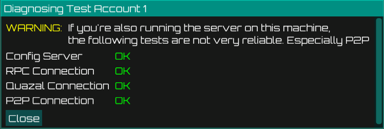
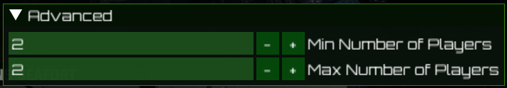

<p align="center">
    
</p>

# Dedicated server for EoL echelon games

This project is a community effort to keep the multiplayer of some
of the games with the great Sam Fisher alive.

For now it is focused on SC:BL, but the net code should be relatively
similar for previous games as well.

[demo.webm](https://github.com/user-attachments/assets/89b33088-aa56-441c-bedc-866c7fa15f1f)

## Quick Start

1.  **Download** the latest [launcher](https://github.com/unixoide/5th-echelon/releases/latest).
2.  **Optional: Install Radmin VPN** or a similar VPN client and join a network with other players. Not a strict requirement, but most players are using this approach
3.  **Start the launcher** (`launcher.exe`).
4.  On the first start, you will be asked to choose a UI version. The new UI is recommended.

    

5.  Select `Join Server`

    

6.  Create a new server profile.

    
    Ask on the [Discord servers](#community) for active server IPs

    

7.  If you connect to a server for the first time, you'll have the option to register a new account.

    

8.  `Save` and click `Launch` to start the game (make sure the right profile was selected).

> ![NOTE]
> If you're having problems connecting, use the `Diagnose` button for more information and suggestions to fix the problem.
> 
> 

## Community

Join our Discord servers to find other players and get help.

- [Spy vs Merc Community](https://discord.com/invite/YgccjKPUNm)
- [Splinter Cell Community Hub](https://discord.com/invite/ubX9D9v)
- [/r/SplinterCell](https://discord.gg/ywdszwF)
- [SCBL Multiplayer](https://discord.gg/uJH5Sv5Zw3)

## Usage

### Starting your own server for others to use

The new launcher comes with an integrated server. You can start it from the `Server Management` tab.

1.  Start the launcher.
2.  Go to the `Server Management` tab.
3.  On first use, the launcher will ask you to download the server executable
4.  Select the network adapter to use (or keep the default of all)
5.  Optional: provide you public IP address in case you're using port forwarding for you server. 
3.  Click `Start` to start the server.

    


## Features

- [X] Entering online mode (successful authenticate and fetch settings etc.)
- [X] Entering the COOP lobby
- [X] Starting a COOP game via `Find Teammate`
- [X] Starting a Spy vs Merc game
- [X] Invite other players (press <kbd>F5</kbd> to open the overlay to accept the invite) into the main lobby.
- [ ] Invite players into a private game lobby (use the `Find Teammate`/`Quick Match` buttons instead)
- [X] Import save games from the original game
- [X] Create a base L5 save game for SvM gameplay
- [X] In-game overlay

  
- [X] Modify the min/max amount of players in a game session (Press `F5` in a game lobby to alter the restrictions). 
      Allows to do COOP missions with more then 2 players or start SvM matches with less then 4.

  

## Build

Last tested rust version: 1.85.0-nightly (d117b7f21 2024-12-31). You can download the rust compiler via https://rustup.rs/.

You'll also need the [Protobuf compiler](https://github.com/protocolbuffers/protobuf/releases/latest). `protoc.exe` should either
be in your `PATH` or pointed at by an environment variable called `PROTOC` (see [this](https://docs.rs/prost-build/latest/prost_build/#sourcing-protoc) for details).

Use https://github.com/casey/just to build:

```shell
# run server in debug mode (builds faster)
$ just serve
# run server in release mode (runs way faster)
$ just serve_release
# build dll and run launcher in debug mode
$ just launch
# build dll and run launcher in release mode
$ just launch_release
```

### Developing Quickstart

Prerequisites:

- You have a Powershell window open.
- Rustup was downloaded from [https://rustup.rs](https://rustup.rs) and is in your Downloads folder.
- Protoc was downloaded from [GitHub](https://github.com/protocolbuffers/protobuf/releases/latest) (e.g. `protoc-30.0-win64.zip`) and is unpacked to `protoc` in your `Downloads` folder.
- You've downloaded the source code from [GitHub](https://github.com/unixoide/5th-echelon/releases/latest/) and unpacked to 5th-echelon

From you `Downloads` folder:

```shell
PS> .\rustup-init.exe --default-toolchain none -y
PS> cargo install just
PS> $env:PROTOC="$PWD\protoc\bin\protoc.exe"
PS> cd 5th-echelon
PS> just release_launcher_embed
```

You can now find the launcher at `5th-echelon\target\release\launcher.exe`

## Additional Tools

Besides the server, there are also additional tools which are meant to aid development.

- DDL parser
- Wireshark dissectors

  - PRUDP/RMC (Quazal)
  - Storm P2P

### DDL parser

You can parse DDLs out of executables (if still included) by using

```shell
$ cargo run --release -p quazal-tools --bin ddl-parser -- -i mapping.json -o ddls.json path/to/exe
```

### Wireshark dissector

There is a rudimentary wireshark dissector for PRUDP/RMC in rust available. You can build and install it on linux via

```shell
$ ./scripts/build_dissector.sh
```

Alternatively there is also a lua based dissector with added support for DO protocol. To install, put `.\tools\quazal.lua`, `.\tools\dormc.txt` and `.\tools\rmc.txt` into the wireshark plugin user directory.

Additionally there is a very basic lua dissector for the Storm P2P protocol.

You can use all dissectors with `tshark` as well:

```
$ tshark -r pcaps/sc_bl.pcapng -d udp.port==3074,prudp -d udp.port==13000,prudp -V -Y udp -x -O prudp,rmc -Y 'udp.port==3074'
```

## Special Thanks

Special thanks to @zerokilo and @michal-kapala for their work on https://github.com/zeroKilo/GROBackendWV
which shares parts of the protocol.
